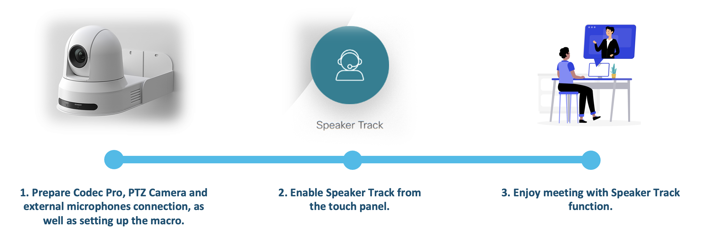
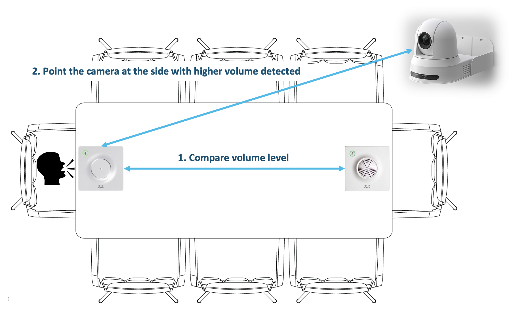

# Webex PTZ Camera Speaker Track

A Macro to enable Speaker Track on the new PTZ camera. Users can turn on and off this feature on the touch panel during or out of a call.

---

The following diagram describes the use case overview.

The following diagram describes the PoV high level design.

## Contacts
* Alvin Lau (alvlau@cisco.com)
* Sing Shum (sishum@cisco.com)

## Solution Components
* Webex PTZ 4K Camera
* Codec Pro
* Cisco Table Microphones
* Webex xAPI

## Working Principles
This macro works with the latest PTZ 4K Camera and two external microphones (Cisco Table Microphone 20 and Cisco Table Microphone 60), all connected to Codec Pro, to provide Speaker Track function. The macro compares the volume received at each microphone and trigger the camera to move to the preset position when the current camera position is not pointing at the speaker side. In order to prevent camera flapping its position due to users speaking at the same time or background noise, several constants and variables are defined in the macro to build a runtime logic.

You can find these constants and variables in macro.js
- NEAR_MICROPHONE_CONNECTOR: The connector ID of the first microphone on Codec Pro
- REMOTE_MICROPHONE_CONNECTOR: The connector ID of the second microphone on Codec Pro
- NEAR_CAMERA_POSITION: The camera preset position ID; When users near the first microphone speak
- REMOTE_CAMERA_POSITION: The camera preset position ID; When users near the second microphone speak
- MICROPHONELOW: The volume level that a user is speaking nearby
- HIT_THRESHOLD: The minimum number of detection that the current speaking side is with the higher volume detected; A.k.a the sensitivity of Speaker Track; The higher the value, the less sensitive the Speaker Track and the longer speaking time to trigger the camera re-position.

## Installation
1. Prepare a macro in Codec Pro.
  - In Codec Pro web dashboard, go to "Macro Editor".
  - Click "Create new macro", name the macro. For example, "PTZ-Speaker-Track".
  - Replace the macro with the content in macro.js.
  - Update all the adjustable constants.
  - Save and enable the macro.

2. Create an initial Speaker Track button.
  - In Codec Pro web dashboard, go to "UI Extensions Editor".
  - Click "New" and add an "Action Button".
  - Fill the form with the following values:
    - Id: ptz-start
    - Name: Speaker Track
    - Button visibility: always
    - Icon: Helpdesk
    - Extension button color: Red
  - Export the configuration by clicking the blue button at the header bar.

3. Test Speaker Track.
  - Toggle the action button to turn Speaker Track on and off.
  - Speak to the individual microphone to see if the camera sets its position respectively.

## License
Provided under Cisco Sample Code License, for details see [LICENSE](./LICENSE)

## Code of Conduct
Our code of conduct is available [here](./CODE_OF_CONDUCT.md)

## Contributing
See our contributing guidelines [here](./CONTRIBUTING.md)
